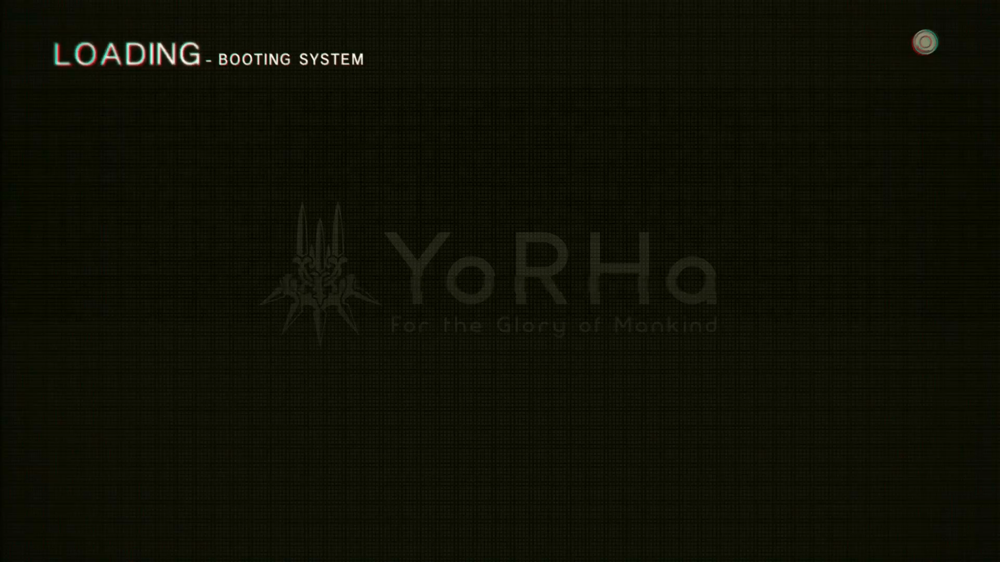

# YoRHa_Boot
KDE Plasma splash screen and grub background with YoRHa boot sequence from Nier Automata

Grub background resolution 1920x1080

---



---

## Install:

cd into cloned repository and install with plasmapkg2:

```
plasmapkg2 -t lookandfeel -i org.1-3-3-7.YoRHa_Boot.splash
```

---

## GRUB image
For ultimate experience install YoRHa grub2 background:

---
### Debian 12

```
sudo mkdir /usr/share/grub_background
```
```
sudo cp grub_image/grub_YoRHa.png /usr/share/grub_background
```
```
sudo chmod -R 644 /usr/share/grub_background && sudo chown -R root:root /usr/share/grub_background
```
```
sudo nano /etc/default/grub
```
Uncomment ```#GRUB_GFXMODE=640x480``` and change resolution to yours, i.e ```GRUB_GFXMODE=1920x1080```
And add line ```GRUB_BACKGROUND=/usr/share/grub_background/grub_YoRHa.png```, save and exit

```
sudo update-grub
```

Look docs for other distros, i.e. https://help.ubuntu.com/community/Grub2/Displays
